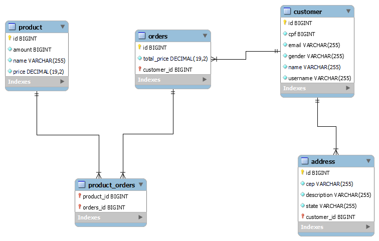

# Java Persistence
Projeto da disciplina Persistencia em Java - Avaliação da Disciplina - MBA FIAP.
- Spring Boot
- Spring Data
- MySQL 5
- Redis
- Open API (Swagger)

## Itens implementados
 - Escrita de modelo do banco de dados
 - Definição das entidades necessárias
 - Desenvolvimento de projeto Java
 - Spring Data JPA + Cache Redis
 - Elaboração de Dockerfile e Docker Compose
 - Implementação do Open API(Swagger) para documentação e testes do recursos da API.


## MER 



## Rodar o projeto
Para rodar o projeto basta executar o script *run.sh*
```
./run.sh
```

## Acessar Aplicação 

- Acesse a aplicação na URL -> `http://localhost:8000/swagger-ui.html`

## JSON Exemplos

- product-controller
```
	{
		"name": "Faca",
  		"amount": 20,
  		"price": 8.50
	}
```

- customer-controller
```
	{
 		 "cpf": 12345678901,
  		 "name": "Nome Teste",
		 "email": "teste@teste.com.br",
  		 "gender": "M",
  		 "username": "teste",
  		 "address": [
			   {
				   "cep": "70790-120",
				   "state": "DF",
				   "description": "Kit"
			   }
  		 ]
	}
```

- address-controller
```
	{
		"cep": "70790-121",
		"state": "DF",
		"description": "Kits"
	}
```

- orders-controller POST
```
	{
		"totalPrice": 100,
		"customerId": 3,
		"productsId": [
			4, 5
		]
	}
```
